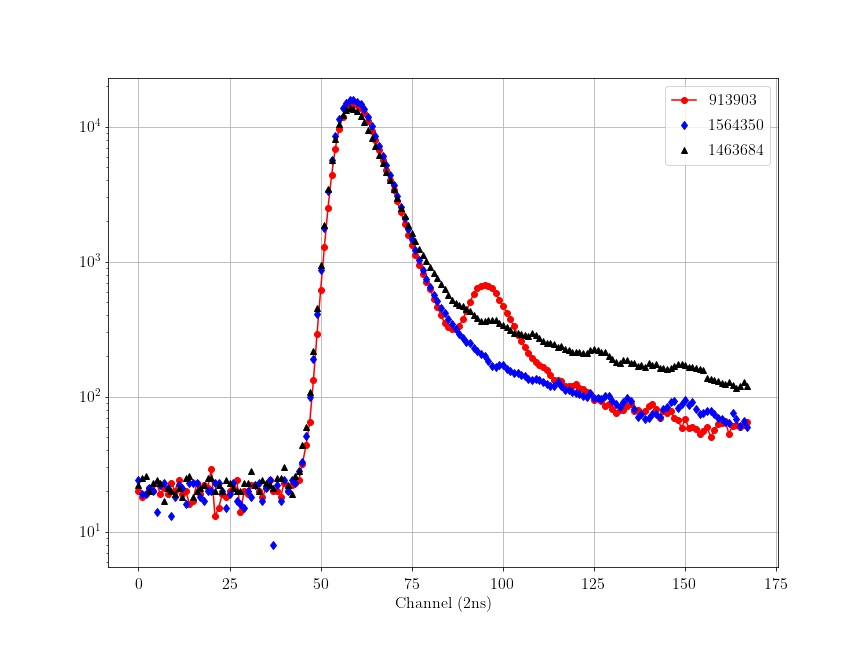
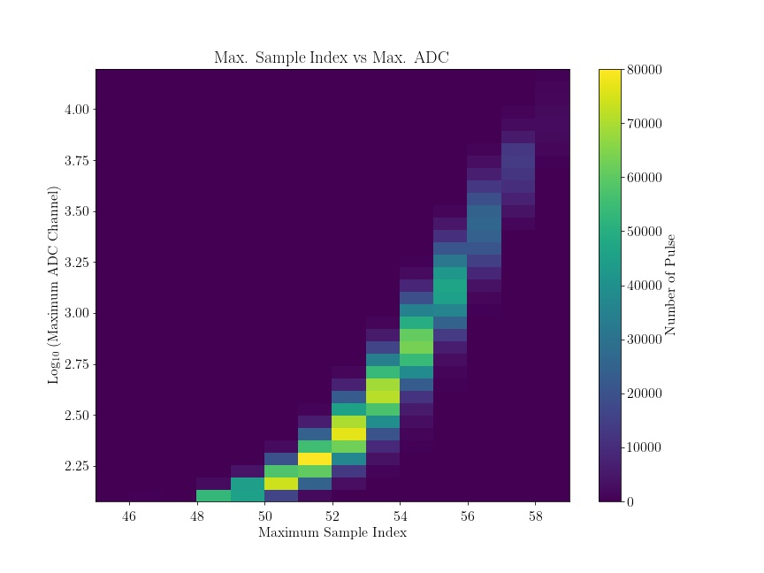
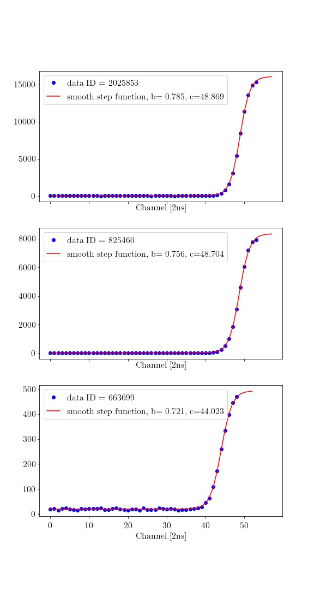

Pulse Shape Discrimination
===

# 1. 실험 세팅

bla.bla

# 2. Peak shape example

- 아마도 15644350 은 전형적인 $\gamma$ shape, 1463684 는 전형적인 neutron shape, 913903 은 전형적인 pile up shape..

# Max. Sample vs Max. ADC

# Rising time fitting
Rising time 이 혹시나 PSD와 관계가 있을 까 하여 아래의 함수로 wave의 시작부터 최고점까지를 아래 함수로 피팅하였다.
$$
y=\dfrac{a}{1+\exp (-b(x-c))}+d
$$
임의의 3 waves 에 대해 피팅 결과를 보여주면 아래와 같으며, 어느 정도 잘 피팅됨을 알 수 있다. <u>그러나 실제로 wave 의 rising part가 위의 함수로 기술되는 물리적 근거는 없다.</u>

- $\displaystyle \lim_{x\to -\infty} y = d$ 이며 $\displaystyle \lim_{x \to \infty} y = a+d$ 이고 $y(x=c)=\dfrac{a}{2}+d$ 이므로 $c$ 가 rising 영역의 중앙이 된다. 

- $1/(1+e^{-bx_1}) = 0.8,\, 1/(1+e^{-bx_2})=0.2$ 라 하면 $x_1-x_2=\dfrac{2}{b}\log 4$ 이므로 $b$ 는 rising 의 가파름을 나타내는 척도이다. 

